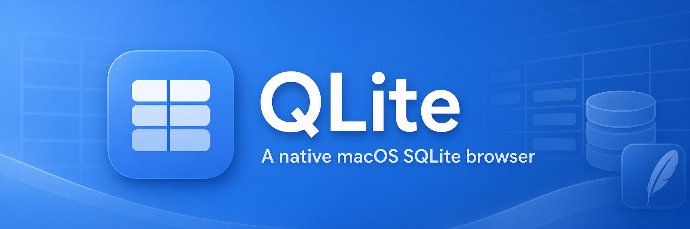
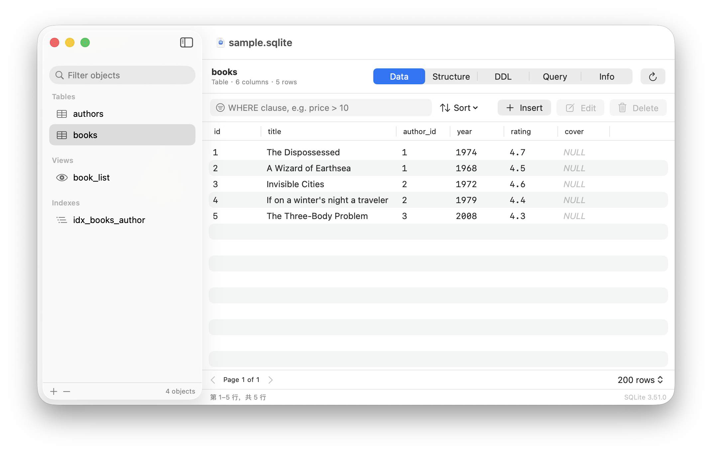

# QLite

A native macOS SQLite browser — open a database, manage its tables and structure, edit rows,
run SQL, and preview any `.sqlite` file straight from Finder with QuickLook.

[简体中文](README.zh-CN.md) · [Changelog](CHANGELOG.md) · [Contributing](CONTRIBUTING.md)

[Download the latest release](https://github.com/Clizo1209/QLite/releases/latest)



## Features

**Browse and edit data**
- Paged table browser (50–1000 rows per page) with server-side sorting and a free-form
  `WHERE` filter, so million-row tables stay responsive.
- Insert, edit and delete rows. Rows are addressed by `rowid`, falling back to the primary key
  for `WITHOUT ROWID` tables; views are correctly detected as read-only.
- NULLs, blobs and numeric types are rendered distinctly, and blobs round-trip through
  `x'…'` hex literals in the row editor.

**Manage schema**
- Create tables with a column builder (type, PRIMARY KEY, AUTOINCREMENT, NOT NULL, UNIQUE,
  DEFAULT, composite keys, `WITHOUT ROWID`).
- Add, rename and drop columns; rename and drop tables; create and drop indexes.
- Inspect columns, foreign keys and indexes in the Structure tab, and the exact
  `CREATE` statement in the DDL tab.

**Run queries**
- Multi-statement SQL editor with `⌘R` to run, `EXPLAIN QUERY PLAN`, per-run timing,
  affected-row counts, and a result grid.
- Export any result set or table page to CSV, TSV, JSON or `INSERT` statements.

**QuickLook**
- Press Space on a `.sqlite`/`.db`/`.sqlite3` file in Finder to see the database's tables,
  their columns, row counts and a few sample rows — without opening the app.
- Finder thumbnails show a database card listing the first table names.
- Both extensions can be turned on and off, and re-registered, from Settings.

**Journal and WAL files**
- Reads `-wal`, `-shm` and `-journal` sidecars, so rows committed to the write-ahead log but
  not yet merged into the main file are visible — in the app *and* in QuickLook.
- When the sidecars cannot be opened in place (read-only volume, sandboxed preview), QLite
  falls back to a temporary copy of the whole file set, and finally to an `immutable` read
  that is labelled as showing the last checkpointed state.
- Opening `foo.db-wal` opens `foo.db`. The Info tab lists the sidecars with their sizes and
  offers a **Checkpoint WAL** action.

**Settings**
- **General** — language (System / English / 简体中文) and whether to read sidecar files.
- **File Types** — which extensions count as databases, add your own, and bind them to QLite
  as their default application.
- **QuickLook** — enable or disable each extension and re-register them with the system.

**Localization**
- English and Simplified Chinese, switchable at runtime without relaunching. Translations
  live in `Resources/Localization/<lang>.lproj/Localizable.strings`.

**Maintenance**
- `PRAGMA integrity_check`, `VACUUM`, and a database info panel with page size, encoding,
  journal mode and user version.

## Install

### From a release

Download `QLite-<version>.dmg` from the [releases page](https://github.com/Clizo1209/QLite/releases),
drag **QLite.app** to **Applications**, and launch it once so macOS registers the QuickLook
extensions. A `.pkg` installer is also published; it registers the extensions for you.

Builds are ad-hoc signed by default. If Gatekeeper blocks the first launch, right-click the app
and choose **Open**, or run `xattr -dr com.apple.quarantine /Applications/QLite.app`.

### From source

```bash
brew install xcodegen
git clone https://github.com/Clizo1209/QLite.git
cd QLite
make run
```

Requirements: macOS 14.4 or newer, Xcode 15.3+ (Swift 5.9+), and
[XcodeGen](https://github.com/yonaskolb/XcodeGen) to generate the Xcode project.

### Why the app is not sandboxed

The App Sandbox grants access to the file the user picked, but not to its `-wal` / `-shm` /
`-journal` neighbours, and it blocks `pluginkit` / `lsregister` and default-app binding. Since
all three are features QLite exists to provide, the app ships unsandboxed and is distributed
outside the App Store. The two QuickLook extensions remain sandboxed.

## Building installers

```bash
make dmg    # dist/QLite-<version>.dmg — drag-and-drop installer
make pkg    # dist/QLite-<version>.pkg — installs to /Applications and registers QuickLook
```

To sign for distribution, export your identities before building:

```bash
export DEVELOPMENT_TEAM="ABCDE12345"
export CODE_SIGN_IDENTITY="Developer ID Application: Your Name (ABCDE12345)"
export INSTALLER_SIGN_IDENTITY="Developer ID Installer: Your Name (ABCDE12345)"
make pkg
```

`Scripts/build.sh` enables the hardened runtime only when a real signing identity is set. It
cannot be used with the default ad-hoc signature: the hardened runtime turns on library
validation, which requires every binary in the bundle to share one Team ID, and ad-hoc
signatures have none — the app would fail to load its own `QLiteKit.framework` at launch.

## Project layout

```
Sources/QLiteKit/        Framework: SQLite engine wrapper, schema reader/editor,
                         data store, query runner, exporters. No UI, fully tested.
Sources/QLite/           The AppKit + SwiftUI application.
Sources/QLitePreview/    QuickLook preview extension.
Sources/QLiteThumbnail/  QuickLook thumbnail extension.
Tests/QLiteKitTests/     Unit tests for QLiteKit.
Resources/Localization/  Localizable.strings for en and zh-Hans.
Examples/sample.sqlite   A small demo database (authors/books) to try things out.
Scripts/                 build.sh, make-dmg.sh, make-pkg.sh, check-localization.sh,
                         generate-icon.swift
project.yml              XcodeGen project definition (the Xcode project is generated).
.github/workflows/ci.yml Continuous integration (see below).
```

`QLiteKit` is shared by the app and both extensions, so a preview shows exactly what the app
would show.

## Keyboard shortcuts

| Shortcut | Action |
| --- | --- |
| `⌘O` / `⌘N` | Open / create a database |
| `⌘1`–`⌘4` | Data · Structure · Query · Info |
| `⌘T` | New table |
| `⌘I` | Insert row |
| `⌘R` | Run query |
| `⌘F` | Focus the row filter |
| `⌘E` | Export the current result |
| `⌘,` | Settings |
| `⌘↩` | Refresh |

## Development

```bash
make project   # regenerate QLite.xcodeproj after changing project.yml or adding files
make test      # run the QLiteKit unit tests
make debug     # debug build
make strings   # check that all translations define the same keys
```

`QLite.xcodeproj` is generated and is not checked in — run `make project` before opening the
project in Xcode.

### Adding a language

1. Copy `Resources/Localization/en.lproj/Localizable.strings` to
   `Resources/Localization/<code>.lproj/Localizable.strings` and translate the values.
2. Add `<code>` to `CFBundleLocalizations` in `project.yml`, and a case to `AppLanguage`
   in [`Sources/QLite/Preferences.swift`](Sources/QLite/Preferences.swift).
3. Run `make strings` — it fails if any key is missing or extra.

### Continuous integration

[`.github/workflows/ci.yml`](.github/workflows/ci.yml) runs on every push to `main`, on every
pull request, and manually from the Actions tab:

- **test** — checks that the translations are in sync, generates the Xcode project with
  XcodeGen, runs the unit tests, and then does a Release build to catch anything that only
  breaks with optimisations or code signing.
- **installers** — only for tags starting with `v`. After the test job passes it builds the
  DMG and PKG and uploads them as workflow artifacts, so a release never ships an installer
  that was built by hand.

## Documentation

- [CHANGELOG.md](CHANGELOG.md) — what changed in each release.
- [CONTRIBUTING.md](CONTRIBUTING.md) — how to set up, where code goes, and the PR checklist.
- [CODE_OF_CONDUCT.md](CODE_OF_CONDUCT.md) — community expectations.
- [LICENSE](LICENSE) — MIT.

## License

MIT — see [LICENSE](LICENSE).
